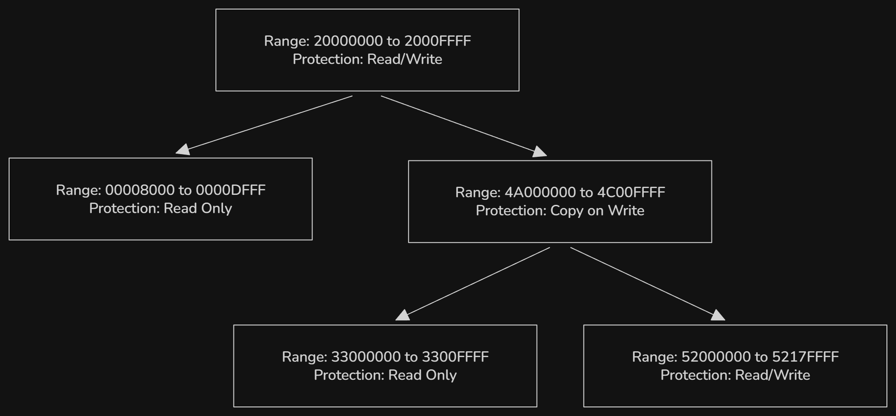
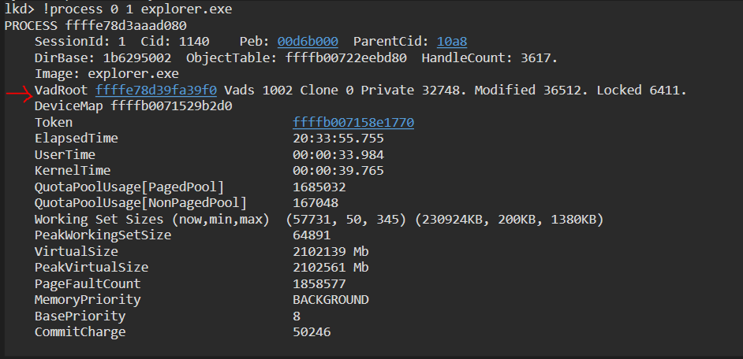

> The Dragon Blood Tree (__Dracaena cinnibari__), a real life binary tree

## VAD Tree

The VAD (Virtual Address Descriptor) is a kernel data structure Windows uses to track virtual memory regions in a process's address space. When a process reserves address space or maps a view of a section, the memory manager creates a VAD to store any information supplied by the allocation request, such a the range of addresses being reserved, whether the range will be shared or private, whether a child process can inherit the contents of the range, and the page protection applied to the pages in the range.  
This metadata lives in the VAD tree, one per process, rooted at `EPROCESS.VadRoot`. The VAD tree is organized into an AVL tree, each node's left subtree holds descriptor for lower address and the right subtree for higher addresses. The AVL tree provides the best balance of search speed and efficient updates (inserting or removing regions when a program calls `VirtualAlloc` or `VirtualFree`) for managing a process's virtual address space



## Data Structures

`_EPROCESS` is the kernel's master structure for a process. Every running process in Windows has one. It contains the process ID, security context, handles, threads, memory-related filed, including the `VadRoot`. Every process has exactly one the VAD tree, the entry point being `_EPROCESS.VadRoot` (of type _RTL_AVL_TREE). The root anchor is `_RTL_AVL_TREE`, which is a wrapper holding a pointer to the root node (`_RTL_BALANCED_NODE`). It is defined as follow:

```cpp
typedef struct _RTL_AVL_TREE {
    PRTL_BALANCED_NODE Root; // points to the top node of the AVL tree
} RTL_AVL_TREE;
```

The `_RTL_AVL_TREE` doesn't contain the tree nodes, it only points to the first node of the tree. Every VAD node is built on `_RTL_BALANCED_NODE`, it's the generic tree node used in the AVL implementation. We can check this on __WinDbg__:

```
0:000> dt nt!_RTL_BALANCED_NODE
ntdll!_RTL_BALANCED_NODE
   +0x000 Children         : [2] Ptr64 _RTL_BALANCED_NODE
   +0x000 Left             : Ptr64 _RTL_BALANCED_NODE
   +0x008 Right            : Ptr64 _RTL_BALANCED_NODE
   +0x010 Red              : Pos 0, 1 Bit
   +0x010 Balance          : Pos 0, 2 Bits
   +0x010 ParentValue      : Uint8B
```

`Left` and `Right` are the child pointers. The tree itself doesn't know about memory regions, it only organizes nodes. Instead, it is embedded inside another structure: the VAD. There are three different versions of VAD entry: [_MMVAD](https://www.nirsoft.net/kernel_struct/vista/MMVAD.html), [_MMVAD_SHORT](https://www.nirsoft.net/kernel_struct/vista/MMVAD_SHORT.html), [_MMVAD_LONG](https://www.nirsoft.net/kernel_struct/vista/MMVAD_LONG.html). Their use depends on how much metadata is needed.

| Type | Used for |
|------|-----------|
| _MMVAD_SHORT | Small, simple memory allocations (e.g., private committed memory) |
| _MMVAD | Standard VAD (includes mapped file info, prototype PTEs) |
| _MMVAD_LONG | Large or special regions (e.g., large pages, certain kernel allocations) |

These are some importants field inside a VAD:

| Field | Meaning |
|-------|---------|
| StartingVpn / EndingVpn | Virtual Page Numbers (VPNs) defining the region range. |
| CommitCharge | Number of pages committed (backed by physical memory or pagefile). |
| Protection (`_MM_PROTECTION`) | Memory protection flags: Read, Write, Execute, Copy-on-Write, etc. |
| u.VadFlags | Bit flags (e.g., private memory, no change, top-down allocation). |
| Subsection | If the region maps a file — points to a subsection of a section object. |
| FirstPrototypePte | Used for file-backed views to refer to prototype PTEs. |

## Viewing the VAD Tree

We can use WinDbg to vew the VAD of a given process. Let's use the following program which allocates 5 memory pages to see things in action:

```cpp
#include <windows.h>
#include <iostream>

int main() {
    std::cout << "Memory allocation loop started.\n";

    const SIZE_T pageSize = 0x1000; // 4 KB
    const int iterations = 5;

    LPVOID allocations[iterations];

    for (int i = 0; i < iterations; ++i) {
        DWORD protect = (i % 3 == 0) ? PAGE_READWRITE :
                        (i % 3 == 1) ? PAGE_EXECUTE_READ :
                                       PAGE_WRITECOPY;

        allocations[i] = VirtualAlloc(
            nullptr,
            pageSize,
            MEM_RESERVE | MEM_COMMIT,
            protect
        );
    }

    std::cout << "Press Enter to exit...";
    std::cin.get();
    return 0;
}
```

Compile the program and execute it. On WinDbg, Start by launching a kernel debugging session, we can display detailed information about a given process with the command `!process 0 1 <program.exe>` replace the program's name with the name of the executable.



Take note of the VadRoot address and the Vads count. To dump the tree, run `!vad <VadRoot>`:

```
lkd> !vad ffffe78d3b9c89c0
VAD             Level         Start             End              Commit
ffffe78d38d02f90  4           7ffe0           7ffe0               1 Private        READONLY           
ffffe78d38d0c6d0  3           7ffee           7ffee               1 Private        READONLY           
ffffe78d38d0d4e0  4         fb53610         fb5370f               6 Private        READWRITE          
ffffe78d38d0c770  2         fb53800         fb539ff               3 Private        READWRITE          
ffffe78d37e9f8a0  3        21ae5fd0        21ae5fdf               0 Mapped         READWRITE          Pagefile section, shared commit 0x10
ffffe78d37ea0ca0  4        21ae5fe0        21ae5fe1               0 Mapped         READONLY           Pagefile section, shared commit 0x2
ffffe78d3f155780  1        21ae5ff0        21ae600c               0 Mapped         READONLY           Pagefile section, shared commit 0x1d
ffffe78d3bc05dc0  4        21ae6010        21ae6013               0 Mapped         READONLY           Pagefile section, shared commit 0x4
ffffe78d38d0dbc0  3        21ae6020        21ae6021               2 Private        READWRITE          
ffffe78d37ea0b60  4        21ae6030        21ae60f8               0 Mapped         READONLY           \Windows\System32\locale.nls
ffffe78d37ea1100  2        21ae6100        21ae6101               0 Mapped         READONLY           Pagefile section, shared commit 0x2
ffffe78d37ea21e0  3        21ae6110        21ae6110               0 Mapped         READONLY           Pagefile section, shared commit 0x1
ffffe78d3b9c87e0  4        21ae6120        21ae6120               1 Private        READWRITE          
ffffe78d3b9c89c0  0        21ae6130        21ae622f              17 Private        READWRITE          
ffffe78d3b9c8a10  4        21ae6230        21ae6249               1 Private        READWRITE          
ffffe78d3b9c8dd0  3        21ae6250        21ae6250               1 Private        EXECUTE_READ       
ffffe78d3b9c9730  2        21ae6260        21ae6260               1 Private        READWRITE          
ffffe78d3b9c9780  4        21ae6270        21ae6270               1 Private        EXECUTE_READ       
ffffe78d37ea0840  3       7ff4e0f80       7ff4e107f               0 Mapped         READONLY           Pagefile section, shared commit 0x5
ffffe78d3b9c7070  4       7ff4e1080       7ff5e109f               0 Private        READWRITE          
ffffe78d3b9c71b0  1       7ff5e10a0       7ff5e30a0               1 Private        READWRITE          
ffffe78d3f154d80  4       7ff5e30b0       7ff5e30b0               0 Mapped         READONLY           Pagefile section, shared commit 0x1
ffffe78d3f154ce0  3       7ff5e30c0       7ff5e30e2               0 Mapped         READONLY           Pagefile section, shared commit 0x23
ffffe78d3f14a6a0  2       7ff71aea0       7ff71aee8               5 Mapped  Exe    EXECUTE_WRITECOPY  \Users\a.exe
ffffe78d2d7ba810  4       7ffdc5050       7ffdc5345               9 Mapped  Exe    EXECUTE_WRITECOPY  \Windows\System32\KernelBase.dll
ffffe78d3bc053c0  3       7ffdc6520       7ffdc65e1               7 Mapped  Exe    EXECUTE_WRITECOPY  \Windows\System32\kernel32.dll
ffffe78d3f14c5e0  4       7ffdc7590       7ffdc7787              16 Mapped  Exe    EXECUTE_WRITECOPY  \Windows\System32\ntdll.dll

Total VADs: 27, average level: 4, maximum depth: 4
Total private commit: 0x49 pages (292 KB)
Total shared commit:  0x5f pages (380 KB)
```

:::note
Notice the `Level 0`, it's the VadRoot. The 4 entries following it are the VAD from our program.
:::

The key columns:

| Column          | Meaning |
|-----------------|---------|
| **VAD**         | Kernel address of this VAD node |
| **Level**       | Position in the internal tree |
| **Start / End** | Virtual page numbers (multiply by 0x1000 to get actual address) |
| **Commit**      | How many pages are actually committed (backed by RAM or pagefile) |
| **Type**        | `Private` = normal heap/stack allocation<br>`Mapped` = file mapping or image (DLL/exe) |
| **Protection**  | Access rights: READONLY, READWRITE, EXECUTE_READ, etc. |

The first entry at address `7ffe0` i always present in every Windows process, it's the `KUSER_SHARED_DATA` page the kernel uses to share system time, version info, etc. with userland without a syscall. Only 3 DLLs is loaded by the program, which are `ntdll.dll`, `kernel32.dll` and `KernelBase.dll`. Every Windows x64 process gets exactly these three, loaded by the kernel before the first instruction runs. They are `Mapped Exe EXECUTE_WRITECOPY`, which means code pages are shared across all processes mapping the same DLL.

## Real-World Use in Defensive Application

In defensive security, the VAD tree is primarly used as a cross-reference to catch memory manipulation. Shellcode or manually mapped code often results in numerous small scattered memory allocation (similar to the loop in our program above), whereas standard modules are usually mapped in larger, contiguous blocks. Malware often allocates memory with `PAGE_READWRITE` (to write code) and then changes it to `PAGE_EXECUTE_READ` (to run it) without backing by a legitimate file. Seeing a region marked as Private memory with `PAGE_EXECUTE_READWRITE` is a red flag.
The VAD tree distinguishes between two main memory allocation types:
- Private Memory: allocated by `VirtualAlloc` (heap, stack). If this region is executable, that's a red flag.
- Mapped Memory (`ImageMap`): Backed by a file on disk (like `kernel32.dll`), it usually includes a path to the file.  

The standard tools for analyzing VAD trees in memory dump is __Volatility__. Specific plugins include `malfind` which flags suspicious VAD protection, `vadinfo` to details VAD nodes and `vadyarascan` to scans VAD regions for YARA signatures. In a future lab, we'll be doing malware hunting with Volatility, for now we'll be focusing on Windows Internals and offensive techniques.

## Conclusion

This was more of a quick learning than a deep dive. One things we can do in the future is implementing a VAD walker driver. In one and a half to two years from now, when I'm very comfortable with the userland side of Windows internals and start doing kernel stuff, __I will write that driver, MARK MY WORD__. For now, I highly suggest reading [Windows Internals 7th Edition](https://www.amazon.fr/Windows-Internals-Part-architecture-management/dp/0735684189) and [Windows 10 System Programming](https://www.amazon.fr/Windows-10-System-Programming-Part/dp/B086Y6M7LH). Until next time ( ͡° ͜ʖ ͡°).
