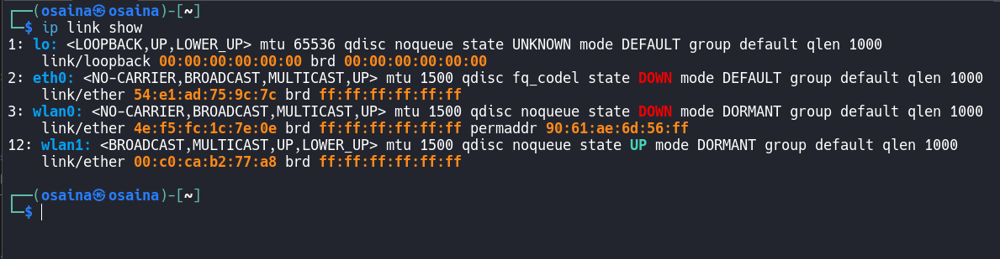
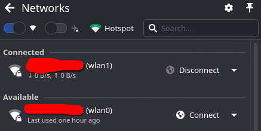
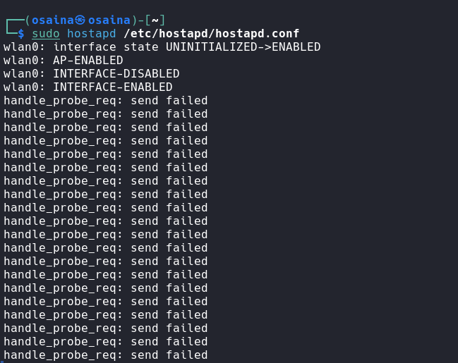
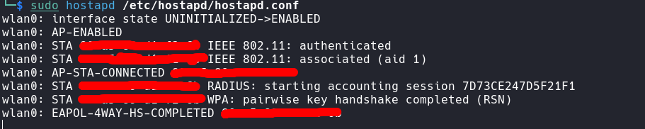
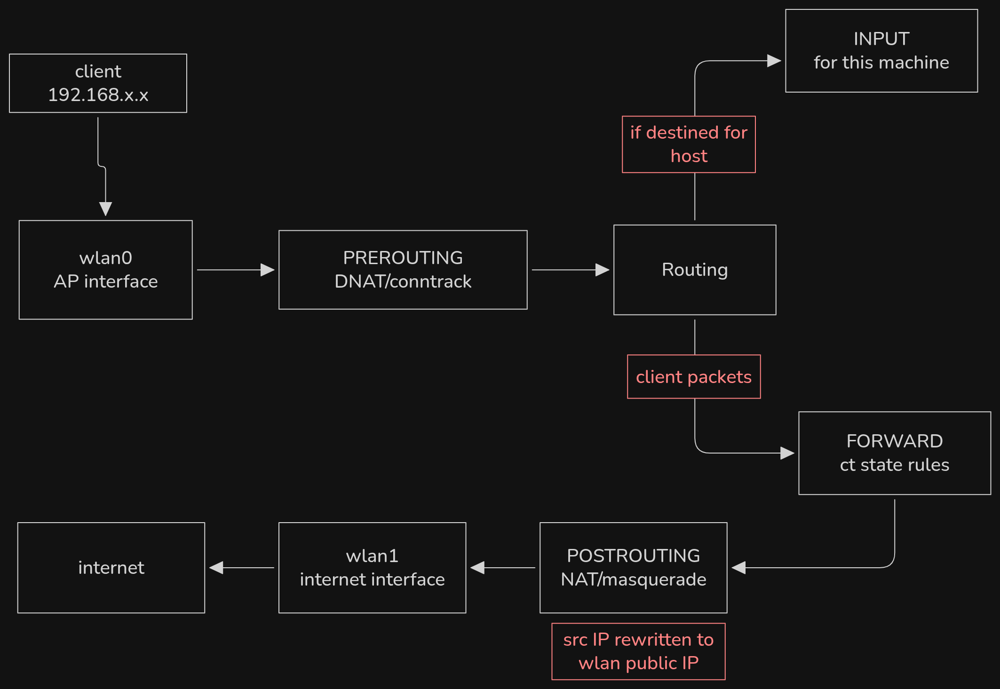
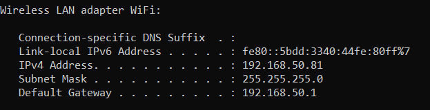
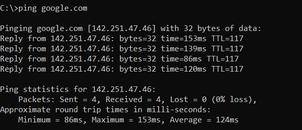

Last year we had an assignment at school where we had to turn a linux machine into a router. I googled everything and completed the task in just 30 minutes without any issue. The thing is I actually didn't understand much what the commands really mean back then. So I decided to do the same project again, but this time the goal isn't to produce a copy-paste router config, but to understand what's actually happening under the surface.

## Setup

For this lab, we're going to need a computer with two network adapters. The first network adapter will be used for creating a LAN network, with which devices can connect to, and the other will be used to connect through the internet. In my case I'll be using the builtin network adapter of my laptop and the WiFi adapter [ALFA AWUSO36NHA](https://www.alfa.com.tw/products/awus036nha?variant=36473966166088), but any wifi adapter should work just fine. Since the LAN network won't be connected directly through the internet, packets will be routed through the second network adapter, and the Linux distro running will act as a router.  
Now plug in the wifi adapter, and check the interface with `ip link show`:  
  


Now connect an interface with the WiFi. I'm using KDE Plasma which makes it easier, here I'm connecting `wlan1` to my WiFi, and `wlan0` will be used for creating an access point (AP for short).



We can also use `nmcli`

```sh
nmcli dev wifi connect "WifiName" password "Password" ifname wlan1
```

Now install `hostapd` and `dnsmasq`, we will use dnsmasq later:

```sh
sudo apt install hostapd dnsmasq
```

After the installation, create `/etc/hostapd/hostapd.conf` with the following config

```ini
interface=wlan0
driver=nl80211
ssid=LAN
hw_mode=g
channel=6
wmm_enabled=0
auth_algs=1
wpa=2
wpa_passphrase=verysecured
wpa_key_mgmt=WPA-PSK
rsn_pairwise=CCMP
```

Assign a static IP to `wlan0` and start hostapd

```sh
sudo ip addr add 192.168.50.1/24 dev wlan0
sudo ip link set wlan0 up
sudo hostapd /etc/hostapd/hostapd.conf
```
You might encouter the following issue, with the error `handle_probe_req: send failed` spam. This is the NetworkManager fighting with hostapd over control of the interface.



`wlan0: INTERFACE-DISABLED` is the NetworkManager taking `wlan0`back and `wlan0: INTERFACE-ENABLED` is hostapd grabbing it again. `handle_probe_req: send failed` is the NetworkManager locking the interface, causing hostapd failing to transmit. The solution is to tell the NetworkManager to leave it alone:

```sh
ip link show wlan0 | grep ether
nmcli device set wlan0 managed no
```

And then restart hostapd. Now we can connect a device to the AP.



As we can expect, the device connected to it cannot access the internet. The packets need to be routed through the other interface which is connected to the internet.

## Enable IP Forwarding

By default, a Linux host is selfish. If an IP doesn't belong to any of the machine's own interfaces, the kernel silently drops the packets. It has no business routing traffic for others, it only processes packets destined for its own IP. Which means that if an endpoint from our AP wants to send data going through the other interface, it will never reach its destination. This, however can be changed by turning __IP forwarding__ on. It allows a system to receive network packets on one interface and forward them to another. IP forwarding can be temporarily enabled by modifying `net.ipv4.ip_forward` kernel parameter using the `sysctl`.

```sh
$ sudo sysctl -w net.ipv4.ip_forward=1
```
To make it permanent, add the configuration to `/etc/sysctl.conf` and add the following line:

```sh
net.ipv4.ip_forward = 1
```

And apply the changes immediately:

```sh
sudo sysctl -p
```

The last command should output the following


What we did here is basically telling the kernel not to drop a packet if the destination isn't the host, but to look up in the routing table and forward it.

## nftables NAT

The next step now is to setup a stateful firewall and NAT using `nftables`, so that devices connected to the AP can reach the internet through the other interface. Basically, a stateful firewall is a firewall that keeps track of the state of active connections and uses that information to decide whether to allow or block traffic. The problem with our setup now is Linux doesn't know what to do with packets arriving on `wlan0` (our AP) that need to go out through `wlan1`. What we need to do now is two things:

- Forwarding rules: allow packets to pass between interfaces
- NAT/Masquerade: rewrite the client's private IP to the machine's public IP so the internet knows where to send replies back.

Every packet passes through Netfilter hooks in a specific order. A hook act as a checkpoint in the Linux kernel where a packet must stop and ask for permission to proceed. The first hook is __PREROUTING__. Decisions here happen before the kernel looks at the routing table. The next and most important hook for us is __FORWARD__. Since the packet is coming from `wlan0` heading to `wlan1`, it isn't for the local machine; just passing through. __INPUT/OUTPUT__ are for packets destined for the machine itself or originating from it. The final hook is __POSTROUTING__, this is the last stop before the packet leaves the physical interface (`wlan1`), __NAT (Masquerade)__ happens here.



NAT Masquerade dynamically rewrites the source IP address of every packet to the current IP address of the router's outgoing interface (in our case `wlan1`). It must happen in __POSTROUTING__ because we know the output interface and the final source IP. If it were used in __PREROUTING__, the routing decision might use the wrong interface.

Now we need to write our rule in `nftables`. Start by creating `/etc/nftables.conf`. First we deletes all existing `nftables` rules before loading these one with `flush ruleset`. We then create a firewall table that works for both IPv4 and IPv6, `filter` is just the table name:

```conf
table inet filter {}
```

This controls what packets are accepted or dropped. Then later creates a NAT table:

```conf
table ip nat {}
```

Instead of `inet` we use `ip`, meaning IPv4 only as NAT is typically IPv4 masquerading/router behavior.

It contains 3 chains:

```conf
table inet filter {
    chain input  {}
    chain forward {}
    chain output {}
}

```

Since the machine acts as a router, `input` is the traffic to the router itself. `forward` is the traffic passing through the router, from `wlan0` to `wlan1`, and `output` is the traffic generated by the router. Before explaining the rules, here's a quick table explaining the syntax:


| Syntax | Meaning |
|--------|---------|
| `iif` | **input interface** - packets arriving on this interface |
| `oif` | **output interface** - packets leaving via this interface |
| `ct state` | **connection tracking state** (new, established, related) |
| `masquerade` | **NAT** - rewrites source IP to hide your LAN behind one IP |
| `counter` | counts matching packets (useful for statistics) |
| `log prefix` | logs dropped packets with a custom label |

### The input chain

As mentioned, the input chain handles packets destined for the host. Examples include SSH to the router, DNS/DHCP requests to router, or even client pinging the router. The first line in the input chain:

```conf
chain input {
    type filter hook input priority 0; policy drop;
```

This is the default deny behaviour, we want everything to be dropped unless explicitly allowed.  
The loopback interface `lo` is `127.0.0.1`. This allows programs on the machine to talk to themselves, so we want that to be allowed:

```conf
iif lo accept
```

The next rule is about connection tracking `ct`:

```conf
ct state established,related accept
```

`state established` is for packets belonging to an already existing connection, like a response from a web page. `related` is for traffic related to an existing connection. Without this, internet browsing would fail because return packets would be blocked. Since we have DHCP running, we also want that to be allowed:

```conf
iif wlan0 udp dport 67 accept
iif wlan0 udp sport 68 accept
```

When a client connects to our AP (`wlan0`), it needs an IP address. The two rules is because DHCP uses UDP on two ports:
- `67` is the DHCP server port (the destination port `dport`), where the router listens for client requests.
- `68` is the DHCP client port (the source port `sport`), where the client listen for the server responses

The same rules for DNS:

```conf
iif wlan0 udp dport 53 accept
iif wlan0 tcp dport 53 accept
```

Since we're here, let's also allow SSH access from the client to the router itself and icmp (used for ping)

```conf
iif wlan0 tcp dport 22 accept
iif wlan0 icmp type echo-request accept
```

The final input rule:

```conf
log prefix "INPUT DROP: " counter drop
```

This is reached if no previous rule matched. It's useful for filtering logs.

### The Forward chain

__FORWARD__ handles packets passing through the machine, not destined for it. The chain declaration is the same as input:

```sh
type filter hook forward priority 0; policy drop;
```

The first rule is allowing return traffic from the internet back to clients, which are packets that belong to already established connections:

```sh
ct state established,related accept
```

We want the client to have access to the internet:

```sh
iif wlan0 oif wlan1 ct state new accept
```

`iif wlan0` is the input interface and `oif wlan1` is the outgoing interface, starting a new connection `state new`. So basically it means accepting __packets coming from wlan0 leaving via wlan1 starting a new connection__. But security reason, the reverse is not allowed unless part of established connection (though it can be bypassed with a reverse shell). Just like with the input rule, log and drop unmatched forwarded packets:

```sh
log prefix "FORWARD DROP: " counter drop
```

### The Output chain


The output chain handles packets generated by the router itself. The default policy is `accept` so the router can freely access the internet, no extra restriction.
```conf
chain output {
    type filter hook output priority 0; policy accept
}
```

The second table after `filter` is the NAT table:

```sh
table ip nat {}
```

It handles Network Address Translation, which is rewriting the IP addresses in packets as they pass through the router. This allows multiple clients on the `wlan0` to share the single internet connection on `wlan1`. It usually operates on IPv4 only here so we use `ip`, not `inet`. The `nat` table has two chain:

```conf
table ip nat {
    chain prerouting {
        type nat hook prerouting priority -100; policy accept
    }
   
    chain postrouting {
        type nat hook postrouting priority 100; policy accept
       
        # Masquerade LAN traffic going out to internet
        oif wlan1 masquerade
    }
}
```

The __PREROUTING__ chain is currently empty. The __POSTROUTING__ chain runs after routing decision, right before packet leaves. The masquerade rule `oif wlan1 masquerade` means any packet leaving via `wlan1` going too the internet gets its source IP rewritten, so the client's private IP is replaced with the router's `wlan1` IP. When the response comes back, the router remembers the translation and forwards it to the correct client.  
Here's the complete `nftables` rules that we write at `/etc/nftables.conf`:


```conf
#!/usr/sbin/nft -f

flush ruleset

table inet filter {
    chain input {
        type filter hook input priority 0; policy drop;
        iif lo accept
        ct state established,related accept

        iif wlan0 udp dport 67 accept
        iif wlan0 udp sport 68 accept

        iif wlan0 udp dport 53 accept
        iif wlan0 tcp dport 53 accept
        
        iif wlan0 tcp dport 22 accept
        
        iif wlan0 icmp type echo-request accept
        
        # Log dropped packets
        log prefix "INPUT DROP: " counter drop
    }
    
    chain forward {
        type filter hook forward priority 0; policy drop;
        ct state established,related accept
        iif wlan0 oif wlan1 ct state new accept
        log prefix "FORWARD DROP: " counter drop
    }
    
    chain output {
        type filter hook output priority 0; policy accept
    }
}

table ip nat {
    chain prerouting {
        type nat hook prerouting priority -100; policy accept
    }
    
    chain postrouting {
        type nat hook postrouting priority 100; policy accept
        oif wlan1 masquerade
    }
}

```

Apply it:

```sh
sudo nft -f /etc/nftables.conf
```

For further reading, go [here](https://wiki.nftables.org/wiki-nftables/index.php/Main_Page#Introduction).  

Now if we connect a client to the AP, it shouldn't be able to ping `wlan0`. The IP address it got in my case is `169.254.247.33`, which is an __APIPA (Automatic Private IP Addressing)__ address. The client fell back to self-assigned addressing because DHCP didn't respond, so let's now work on that.

## DNS + DHCP with dnsmasq

`dnsmasq` is first and foremost a fast, lightweight DNS proxy + cache, with a very good DHCP server included. It's the swiss army knife for local networking. It does two main jobs:
- DNS: getting the IP address of a domain (like google.com)
- DHCP: automatically gives IP addresses, subnet masks, gateway, and DNS servers to devices connected to a network.

Here's the configuration, to be pasted at `/etc/dnsmasq.d/lab.conf`

```conf
interface=wlan0
no-dhcp-interface=wlan1
dhcp-range=192.168.50.50,192.168.50.150,255.255.255.0,24h
dhcp-option=3,192.168.50.1
dhcp-option=6,192.168.50.1
server=8.8.8.8
server=8.8.4.4
cache-size=150
log-dhcp
```

`dnsmasq` will listen on the `wlan0` interface, it will provide DHCP/DNS service only on that interface. In the next line we disable DHCP service on `wlan1` because it's an upstream WiFi client connection. The following line: 

```sh
dhcp-range=192.168.50.50,192.168.50.150,255.255.255.0,24h
```

The IP range is __192.168.50.50-192.168.50.150__, with a subnet mask `255.255.255.0` (network is 192.168.50.x) and a lease time of 24h. So clients connecting to the AP get addresses that are valid for 24 hours before renewing. The next is the default gateway and the DNS server:

```sh
dhcp-option=3,192.168.50.1
dhcp-option=6,192.168.50.1
```

Option 3 is the default gateway, here the router's IP on `wlan0`. Without it, clients don't know where to send internet-bound traffic. Option 6 is the DNS server, for translating domain names to IPs. Here we use `wlan0`'s IP to send DNS requests, which forward them. When the router receives DNS request from a client, it forwards it to `8.8.8.8` and `8.8.4.4`. The client thinks the DNS server is the router itself, so when packets hits the router's `wlan0` interface, nftables __INPUT__ chain processes and accepts it. `dnsmasq` is listening on port 53 of `wlan0`, it catches the DNS query. Since it's configured with `server=8.8.8.8`, it creates a completely new DNS query to 8.8.8.8. The nftables NAT rules apply and the IP is rewritten to `wlan1`'s IP, remember `oif wlan1 masquerade`. When 8.8.8.8 responds, dnsmasq gets the response and sends the answer back to the client. This is part of an established connection (`ct state established,related accept `) so it's allowed.

Let's now start `dnsmasq` in foreground so we can see debug

```sh
sudo dnsmasq -C /etc/dnsmasq.d/lab.conf --no-daemon
```

Now disconnect and reconnect the client from the AP, it should get an IP address and be able to access the internet. So we have a functional router now




Now devices connected to our AP can access the internet, but we're not quite done yet.

## Going Recursive with Unbound

When we use `8.8.8.8`, the router asks Google's resolver for `example.com` and trust whatever it says. Google sees every domain a client on the network every queries, a privacy violation for us. With Unbound the router becomes its own recursive resolver, it starts from the root and finds answer itself. With our current setup, a client asks dnsmasq where's google.com which it doesn't know so it ask Google's DNS server at `8.8.8.8`. The DNS server does all the hard work of finding the answer, and sends answer back to dnsmasq which gives the answer back to the client. Unbound does things differently. When we type a website name like `google.com`, Unbound goes out and finds the answer by querying the DNS hierarchy itself, starting from the root servers, then the TLD servers (`.com`), then the authoritative server for that domain, and returns the final address to the client. It stores answers for a while (caching) so repeated lookups are fast instead of re-querying very time. Because Unbound talks directly to authoritative name servers, we don't have to trust a third-party resolver like Google's 8.8.8.8 or the ISP's DNS. Start by installing Unbound:

```sh
sudo apt install unbound unbound-anchor
```
Now create `/etc/unbound/unbound.conf.d/lab.conf`:

```conf
server:
    interface: 127.0.0.1
    port: 5353
    
    access-control: 127.0.0.1 allow
    
    verbosity: 1
    
    qname-minimisation: yes
    
    cache-min-ttl: 300
    cache-max-ttl: 86400
    
    prefetch: yes
    
    harden-glue: yes
    harden-dnssec-stripped: yes
    
    num-queries-per-thread: 1024
    
    root-hints: /var/lib/unbound/root.hints
```

The first line `server:` is the start of the main server configuration block. Unbound listens on the local machine, which means only the machine can use the resolver, no other machine on the network can query it and we want it to listen on port `5353`:

```sh
interface: 127.0.0.1
port: 5353
```
The following line allows DNS queries from localhost only:

```sh
access-control: 127.0.0.1 allow
```
Without this, Unbound may refuse requests. Together with `interface`, this locks the resolver down to local access. `verbosity: 1` controls logging detail, the value 1 is for basic useful logs, 0 is very quiet. Next we want privacy feature:

```sh
qname-minimisation: yes
```

Normally a resolver might ask what the full domain name is to every DNS server in the chain. With qname minimisation, Unbound reveals only the minimum needed. This reduces information leakage.

```
Root server:
".com?"

.com server:
"example.com?"

example.com server:
"www.example.com?"
```
Earlier in this section I mentioned that Unbound stores answers for a while, we can specify the minimum and maximum cache lifetime or TTL (Time To Live):

```sh
# ttl in seconds
cache-min-ttl: 300
cache-max-ttl: 86400
```

Even if a DNS record says `TTL = 30 secs`, Unbound keeps it for at least 300 seconds (5 min). The same for maximum lifetime. We set it to 24h so even if a domain says `TTL = 7 days` Unbound won't cache it longer than 1 day. This has for effect fewer upstream queries, faster repeat lookup and slightly less fresh DNS data.  
`prefetch: yes` is a smart caching feature. If a cached record is about to expire and users still request it frequently, Unbound refreshes it in the background. Now a bit of security hardening. `harden-glue` makes unbound stricter about trusting DNS records, helping reduce certain DNS spoofing/cache poisoning attacks. The following is a DNSSEC protection:

```sh
harden-dnssec-stripped: yes
```
It prevents attackers from stripping DNSSEC validation information out of replies. Without this protection, secure domain appears insecure. This option helps detect tampering. Before last, let's limit how many outstanding DNS queries each thread can handle simultaneously:

```sh
num-queries-per-thread: 1024
```
A higher value is for better concurrency, but uses more memory. This is reasonable for modern systems. But if you computer is a potato, you can set this to a lower value which is fine for a home network. The last line points Unbound to the list of DNS root servers:

```sh
root-hints: /var/lib/unbound/root.hints
```

Unbound uses these to start iterative resolution from the DNS root. Without root hints, Unbound wouldn't know where the DNS hierarchy begins. This is then our next task, downloading fresh root hints:

```sh
sudo wget -O /var/lib/unbound/root.hints https://www.internic.net/domain/named.root
```

Then edit `/etc/dnsmasq.d/lab.conf` and change the server lines, comment our Google DNS:

```sh
# server=8.8.8.8
# server=8.8.4.4

# Point to Unbound on localhost port 5353
server=127.0.0.1#5353
```

Save and restart both services:

```sh
sudo systemctl restart unbound
sudo dnsmasq -C /etc/dnsmasq.d/lab.conf --no-daemon  
```

## Conclusion

You can now reconnect the device to the AP and enjoy a bit of privacy! Of course theres a lot we can do to improve the privacy, like VPN, Pi-hole, DNS-over-TLS but that's for another time. Hope this helped. If you have a very old computer that can't run Windows 11, don't let it collect dust! Turn it into a fully functional router. Until next time :).
