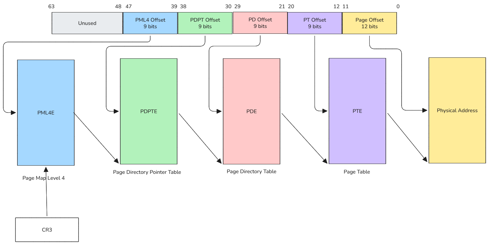
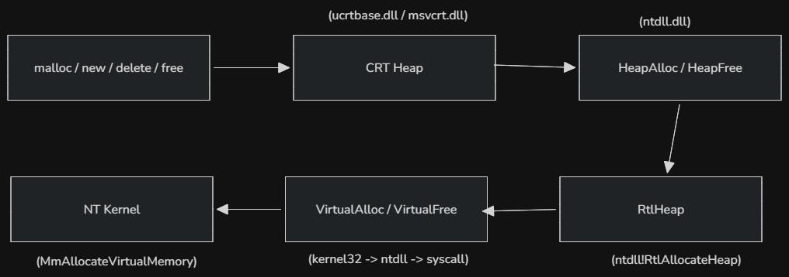
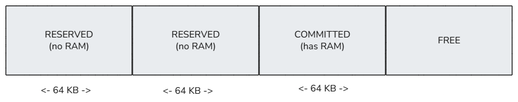

### The User/Kernel Boundary

Each process in Windows thinks it has a contiguous block of memory, called the virtual address space (VAS). The virtual memory is logical, it doesn't necessarily correspond directly to physical RAM. The CPU, via the __Memory Management Unit__ (MMU) and page tables, translates virtual addresses to physical addresses.  
Windows divides each process's virtual address space into two major regions:

- User-mode (user virtual addresses): this is where programs store code, data, heap, stack, and memory-mapped files. It's used by user-mode applications (e.g., Chrome, Notepad)
- Kernel-mode (system virtual addresses): only the kernel and drivers can access it. This is where the kernel stores its code, drivers, kernel data structure, and memory pools.

Windows maintains a shared memory region called `KUSER_SHARED_DATA` at a fixed address `0x7FFE0000` (both 32/64-bit), and mirrored at `0xFFFFF78000000000` in kernel space — same physical page, two virtual addresses. It's intentionally placed there by the kernel so user-mode programs can read things like the current system time without making a slow syscall. The address can be read in assembly as follows

```asm
mov eax, [0x7FFE0000]
```

If a driver running in kernel mode executes this instruction, it would page-fault — `0x7FFE0000` is not mapped in the kernel's virtual address space. The same isolation applies in reverse: user-mode code cannot dereference kernel addresses. This separation is the foundation of OS security; a single bad pointer in user mode cannot corrupt the kernel.

## Paging

As I mentioned before, the CPU translates virtual addresses to physical addresses via the MMU and page tables. But what a page table exactly is?
Every process thinks it has its own large, private, and contiguous block of memory. In reality, this memory might be scattered across different parts of the physical RAM or even temporarily stored on the hard drive (the page file). When a process access data in memory, it uses a virtual address. Both virtual and physical memory are divided into fixed-size blocks called __pages__ (usually 4KB), instead of managing memory byte-by-byte, Windows manages it page-by-page. So when a program allocates 100 KB of memory, Windows splits it into 25 pages of 4k each.  
A page table is a data structure that stores mapping between virtual addresses and physical addresses. Windows uses it to translate a virtual address into a physical address.  
On 64-bit Windows, a process can have up to 16 TB of virtual address space. The OS doesn't use a single flat array that maps each 4 KB page. Instead, it uses a hierarchical page table, which break the virtual address into chunks that index successive tables. A PTE is an 8-byte entry in the page table. Each PTE tells the CPU if the virtual page is present in RAM, where the corresponding physical page is, the permissions and other flag. So a PTE is a metadata for one 4 KB virtual page.  
The x64 CPU uses a 48-bit virtual address. This address is split into 5 parts: 4 indexes and 1 offset.

| Bits 47-39 (9 bits) | Bits 38-30 (9 bits) | Bits 29-21 (9 bits) | Bits 20-12 (9 bits) | Bits 11-0 (12 bits) |
| :--- | :--- | :--- | :--- | :--- |
| **PML4E Index** | **PDPTE Index** | **PDE Index** | **PTE Index** | **Page Offset** |


On 64-bit Windows, only 48 bits are used (47-0), with bits 48-63 being sign-extended.



When the MMU wants to map a virtual page to a memory page, it will access an entry from each table what will lead to the next paging structure in line. This process will go on until the physical page is retrieved.

> Paging can't be covered in this section. There's a whole article just covering this subject. I recommends reading [this](https://connormcgarr.github.io/paging/) and [this](https://blog.xenoscr.net/2021/09/06/Exploring-Virtual-Memory-and-Page-Structures.html) for a complete explanation. For the trully obsessive, go read Intel/AMD manuals.

Windows separates reserving address space from committing. When using `MEM_RESERVE` (with `VirtualAlloc`), the OS marks a range of virtual addresses as reserved in the process's VAD tree. No PTEs are created yet, attempting to read/write may causes a page fault. When `MEM_COMMIT` is used, the OS ensures backing storage exists (RAM + pagefile space that matches the size).

```c
// Reserve 64KB
void* ptr = VirtualAlloc(NULL, 0x10000, MEM_RESERVE, PAGE_READWRITE);
// Commit first 4KB
VirtualAlloc(ptr, 0x1000, MEM_COMMIT, PAGE_READWRITE);
```

:::note
Reserved memory consumes no pagefile or RAM, only VAD entry
:::

## User-Mode Heaps vs Virtual Allocations

Windows memory allocation exists in layers, each building on the one below:



`VirtualAlloc` is the raw OS primitive. It talks directly to the VMM (Virtual Memory Manager).

```c
LPVOID VirtualAlloc(
    LPVOID lpAddress,
    SIZE_T dwSize,
    DWORD  flAllocationType,
    DWORD  flProtect
);
```

When used to reserve a virtual address space, the starting address is rounded to a 64 KB boundary, because reservations happen in chunks aligned to 64 KB. 



It only costs actual memory when committed. Calling `VirtualAlloc` per small object is catastrophic, it's only suitable for large allocations (e.g, thread stacks, memory-mapped regions, large buffer). Consider the following line of code: 

```c
void* p = VirtualAlloc(NULL, 1, MEM_RESERVE | MEM_COMMIT, PAGE_READWRITE);
```
The OS gives 4 KB committed, inside a 64 KB reserved region. 65535 bytes are wasted in the VA space if this is done repeatedly.  
Heaps are user-mode managers built on top of `VirtualAlloc`. A process has a default heap, and additional private heaps can be created with `HeapCreate`. `HeapAlloc` manages smaller allocations efficiently by requesting larger chunks from the OS via `VirtualAlloc` and then suballocating from them. It provides smaller minimum allocation sizes (often 8-byte aligned or similar).  
The CRT maintains its own heap handle(s). `malloc` does not call `VirtualAlloc` directly, it calls into the CRT heap which in turn calls `HeapAlloc`. For very large allocations, the heap often falls back to direct `VirtualAlloc` under the hood for efficiency.

## VirtualAlloc vs NtAllocateVirtualMemory

This is the classic high-level Win32 API vs NT API distinction. `Kernel32!VirtualAlloc` is a Win32 convenience wrapper. It validates and normalizes parameters (rounding size up to a page boundary, address down to a 64 KB allocation-granularity boundary), then calls `NtAllocateVirtualMemory`, inspects the returned `NTSTATUS`, and translate it into a Win32 error code via `RtlNtStatusToDosError` before calling `SetLastError`. This is why `GetLastError()` works after `VirtualAlloc` but returns meaningless data after a direct NT call.  
`Ntdll!NtAllocateVirtualMemory` is a thin syscall stub. On x64 it loads a syscall number (SSN) into `eax` and executes syscall. It exposes extended flags that `VirtualAlloc` sanitizes out. These flags are

| Flag | Purpose |
|------|---------|
| `MEM_PHYSICAL` | Allocate physical memory (for drivers, AWE) |
| `MEM_TOP_DOWN` | Allocate from high addresses (kernel-mode prefers this) |
| Zero-bits parameter | **ASLR hint** – number of high-order address bits that must be zero |

User-mode hooks are typically placed on `Ntdll!NtAllocateVirtualMemory`. Code that calls `VirtualAlloc` will hit those hooks; code that resolves the SSN and issues syscall directly (a "direct syscall" or "syscall stomping" technique) bypasses the hook entirely. The kernel sees the same operation either way, the NT kernel function is identical; but the ring-3 telemetry gap is exactly this boundary.

## Memory Sections

A section object is the kernel primitive for sharing memory between processes, mapping files into address space, and backing virtual memory with either a file or the paging file. They provide an efficient way to share data between processes. When creating a section, how the section's storage should be allocated and managed needs to be specified. This is where `SEC_IMAGE`, `SEC_COMMIT`, and `SEC_RESERVE` come into play.

| Feature | SEC_IMAGE | SEC_COMMIT | SEC_RESERVE |
|---------|-----------|------------|-------------|
| Backing storage | Disk file | Page file | Page file |
| Physical memory at creation? | Only when view mapped | Yes (for entire size) | No |
| Commit charge consumed? | When pages are faulted in | Immediately (full size) | No |
| Can resize? | No | No | Yes (via `ZwExtendSection`) |
| Page protections | From PE headers | Uniform (as specified) | Uniform (as specified) |
| Required privilege | Read access to file | None | None |

`SEC_RESERVE` is the `MEM_RESERVE` analogy but at the section level. Address space is claimed so no other allocation can use it, but no RAM or pagefile quota is spent. To actually use a page, it must be committed with `NtAllocateVirtualMemory(MEM_COMMIT)` within that range, or map the section with `SEC_COMMIT`. When `SEC_COMMIT` is used, physical memory is allocated immediately for the entire section size. It ensures that any page in the section is immediately usable without extra allocation steps. It's suitable for shared memory of known, fixed size, but can cause allocation failure if not enough commit limit. `SEC_RESERVE` doesn't have physical storage allocated initially, it only reserves a contiguous range of virtual addresses. Pages are in a reserved state; accessing them causes a page fault until committed or mapping views with `SEC_COMMIT`.

## Conclusion

I avoided this subject for a while, but understanding the Windows memory model is mandatory if you want to do kernel stuff later, so I just had to do it at some point. There's a lot more that needs to be covered, but it's an already confusing subject and this blog post would turn into a book. If you want to go deeper, go read the Bible [Windows Internals 7th edition](https://www.amazon.fr/Windows-Internals-Part-architecture-management/dp/0735684189)
